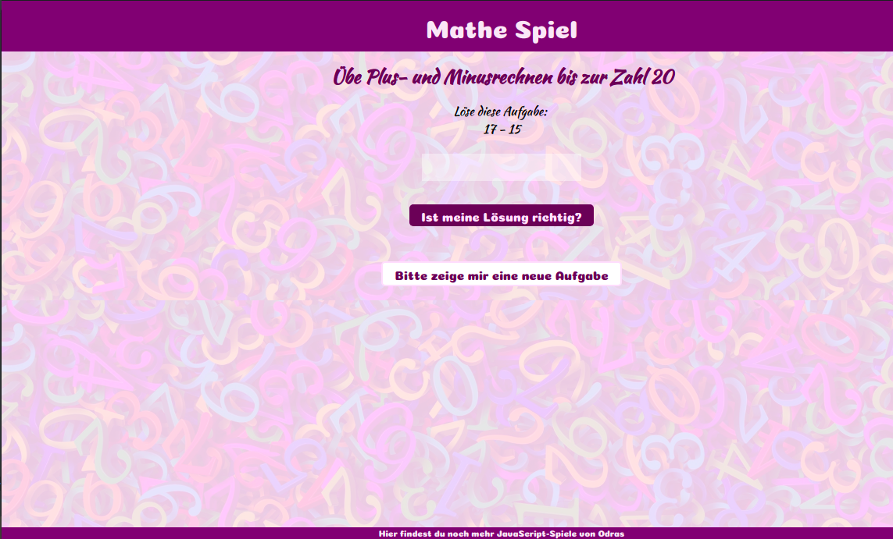

# Math Game for elementry school kids

## Preview

---
#### **[Visit Poject Site &raquo;](https://playground.odras.de/MathGame/index.html)**
---

## Features
- gives a randomly generated math addition or substraction exercise with numbers between 0 and 100
- no exercises with results greater than 100 or less than 0
- gives feedback to user if the result is correct or not

## Technologies
- JavaScript
- HTML/CSS/SCSS

